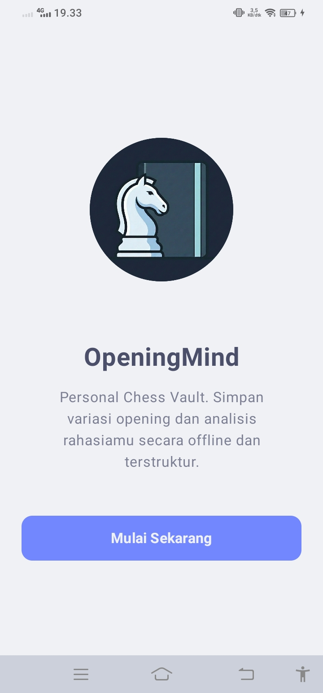
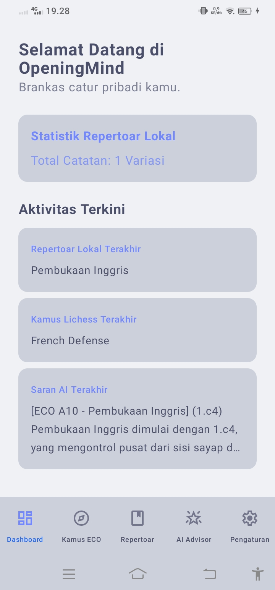
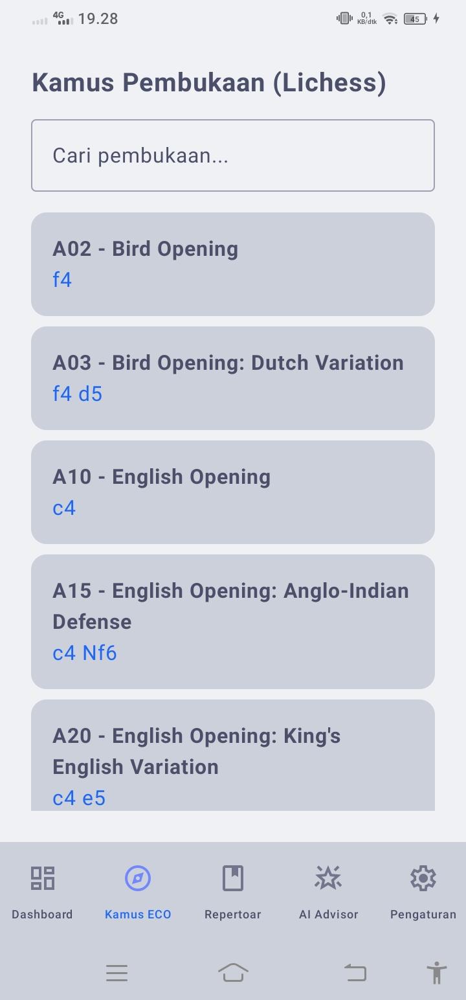
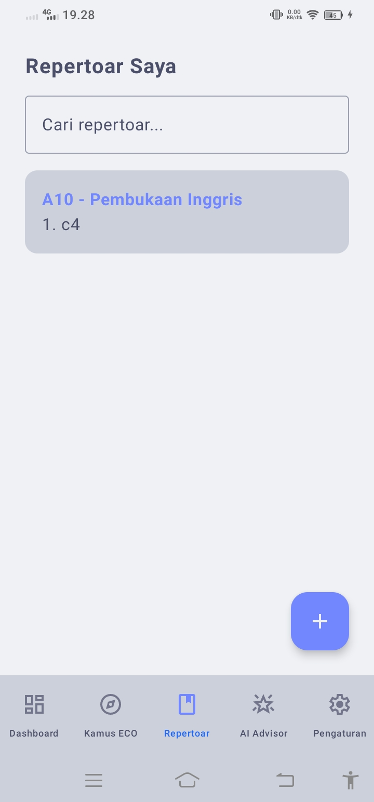
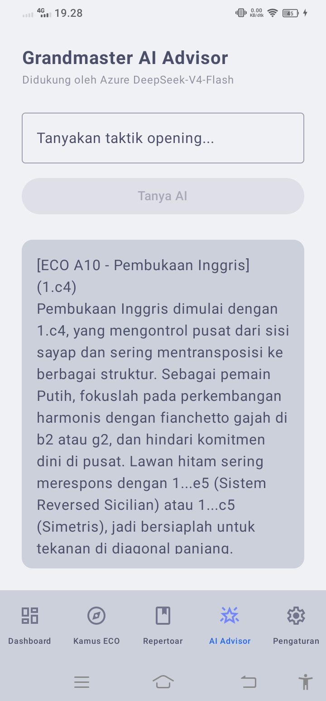
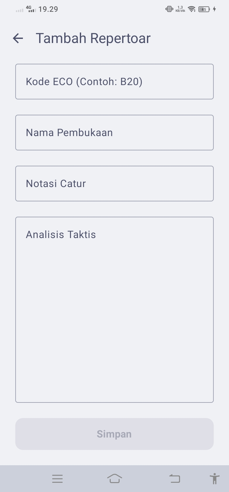
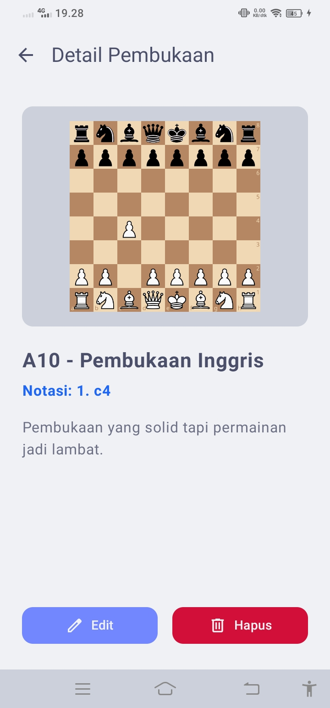
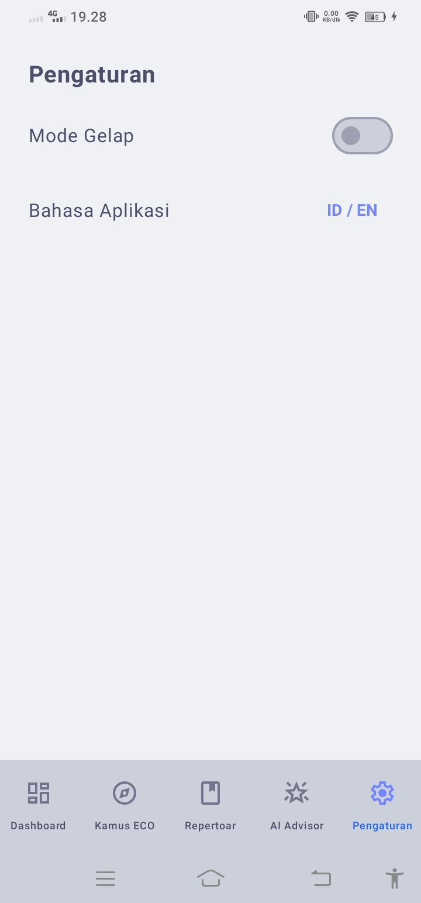

# OpeningMind

OpeningMind adalah aplikasi Android yang dirancang sebagai asisten digital untuk membantu pemain catur mengelola, mempelajari, dan merancang variasi pembukaan (opening) secara personal. Aplikasi ini dikembangkan sebagai kelanjutan dari usulan proyek UTS, dengan penyempurnaan menyeluruh pada pemisahan arsitektur, sinkronisasi data lokal, serta integrasi asisten cerdas berbasis kecerdasan buatan (AI).

---

## Anggota Kelompok
Proyek ini dikembangkan oleh:
- Achmad Reihan Alfaiz (2410817210019) - Senior Mobile Developer & UI/UX Engineer
- Muhammad Azri Rahman (2410817110016) - Junior Mobile Developer & System Analyst

---

## Kaitan dengan Proyek UTS & Catatan Revisi
Aplikasi ini merupakan realisasi penuh dari rancangan dasar yang diajukan pada UTS. Kami melakukan beberapa revisi arsitektural dan penambahan fitur kunci untuk memenuhi standar kompetensi UAS:

| Komponen | Status di Rancangan UTS | Implementasi Riil di UAS |
| :--- | :--- | :--- |
| **Arsitektur Kode** | Belum terdefinisi secara spesifik (hanya sebatas wacana UI). | Penerapan penuh **Clean Architecture** dengan pemisahan UI, Domain, dan Data layer serta pola desain **MVVM**. |
| **Pengelolaan State** | Asumsi penggunaan XML atau Compose statis. | Menggunakan ViewModel (RepertoireViewModel dan SettingsViewModel) serta StateFlow di Jetpack Compose agar state retention terjaga saat rotasi perangkat (portrait ke landscape). |
| **Local Database (BREAD)** | Direncanakan menggunakan Room DB (berupa Mockup UI). | Room DB telah berjalan penuh. Pengguna dapat melakukan BREAD (Browse, Read, Edit, Add, Delete) ke tabel SQLite lokal secara real-time. |
| **Integrasi API** | Direncanakan menggunakan Lichess API. | Mengimplementasikan pemanggilan asinkron menggunakan Retrofit untuk menampilkan data Lichess ke dalam LazyColumn dengan strategi caching lokal. |
| **Fitur Tambahan (Nilai Plus)** | Direncanakan membuat fitur Dark Mode dan Bilingual. | Selain menerapkan Dark Mode dan integrasi Dagger-Hilt (DI), kami menambahkan fitur out-of-the-box berupa Grandmaster AI Advisor yang terintegrasi langsung dengan LLM DeepSeek-V4-Flash melalui Microsoft Azure AI Foundry untuk analisis taktis interaktif. |

---

## Daftar Halaman (8 Layar Utama)
Aplikasi ini memiliki 8 halaman/view fungsional yang melampaui standar minimal 6 halaman:
1. **Halaman Onboarding:** Tur selamat datang visual untuk menyapa pengguna baru pertama kali.
2. **Dashboard:** Ringkasan statistik jumlah repertoar lokal yang dimiliki pengguna.
3. **Kamus ECO (Lichess):** Penelusuran teori pembukaan catur dunia yang ditarik dari Lichess API.
4. **Repertoar Saya:** Daftar koleksi pembukaan pribadi yang disimpan secara lokal di SQLite.
5. **Grandmaster AI Advisor:** Ruang konsultasi taktis interaktif berbasis obrolan kecerdasan buatan.
6. **Halaman Pengaturan:** Konfigurasi kustomisasi tema (Gelap/Terang) dan bahasa (ID/EN).
7. **Halaman Detail:** Informasi mendalam untuk setiap notasi, deskripsi langkah, dan tombol hapus data.
8. **Halaman Form (Tambah/Edit):** Antarmuka input data masukan secara dinamis untuk mengelola repertoar.

---

## Komponen Wajib Aplikasi (UAS)

### 1. Recycle-able List
Menerapkan LazyColumn pada halaman Kamus ECO dan Repertoar Saya untuk merender data pembukaan catur secara dinamis dengan performa yang mulus dan efisiensi memori yang tinggi.

### 2. Responsif dan State Management
Menggunakan ViewModel dan StateFlow untuk memastikan data input pada form dan status konfigurasi sistem (seperti preferensi bahasa dan tema gelap) tetap terjaga meskipun terjadi rotasi layar atau pembersihan memori latar belakang (state retention).

### 3. Arsitektur MVVM
Memisahkan logika aplikasi ke dalam tiga komponen utama:
- **Model:** Struktur data inti (Repertoire).
- **View:** Komponen UI menggunakan Jetpack Compose.
- **ViewModel:** Terbagi secara spesifik menjadi RepertoireViewModel (mengelola data catur dan AI) dan SettingsViewModel (mengelola konfigurasi preferensi sistem).

### 4. Fetching Data Remote
Mengintegrasikan Lichess Opening Explorer API menggunakan library Retrofit untuk menarik data statistik dan teori pembukaan catur secara real-time.

### 5. Clean Architecture
Struktur kode dibagi menjadi tiga layer utama untuk mematuhi prinsip Separation of Concerns:
- **UI Layer (Presentation):** Berisi Compose Screen, Theme, serta RepertoireViewModel dan SettingsViewModel.
- **Domain Layer:** Berisi entitas model bisnis murni, kontrak repository (RepertoireRepository dan SettingsRepository), serta Use Cases bisnis.
- **Data Layer:** Berisi implementasi Repository, Room Database (AppDatabase, DAO, dan Entity), UserPreferences, dan Retrofit API Service.

### 6. Local Database & Cache Strategy
Menggunakan Room Persistence Library sebagai basis penyimpanan lokal utama. Kami juga mengimplementasikan UserPreferences secara internal untuk merekam preferensi tema dan bahasa secara persisten, serta database cache (RemoteOpeningEntity) untuk mengamankan data API Lichess secara offline.

### 7. Fungsi BREAD Terintegrasi
Mendukung siklus hidup data lengkap pada entitas repertoar lokal:
- **Browse:** Menampilkan daftar koleksi repertoar pribadi.
- **Read:** Membaca detail pembukaan dan notasi catur secara mendalam.
- **Edit:** Memperbarui catatan taktis catur yang sudah ada di database.
- **Add:** Menambahkan strategi baru ke dalam Room Database.
- **Delete:** Menghapus variasi pembukaan dari daftar koleksi lokal.

---

## Fitur Tambahan (Nilai Plus)
- **Grandmaster AI Advisor:** Integrasi dengan LLM DeepSeek-V4-Flash melalui Microsoft Azure AI Foundry untuk saran taktik catur interaktif.
- **Dependency Injection:** Menggunakan Dagger-Hilt yang dibagi secara modular (AppModule dan SettingsModule) untuk manajemen dependensi yang otomatis.
- **Bilingual Support:** Mendukung Bahasa Indonesia dan Bahasa Inggris yang dapat diganti secara dinamis dan persisten via SettingsViewModel.
- **FEN Generator Use Case:** Menyertakan GetFenFromNotationUseCase untuk membantu kalkulasi visual dari notasi langkah standar ke bentuk FEN (Forsyth-Edwards Notation).

---

## Informasi API
1. **Lichess Opening Explorer API:** Penyedia teori pembukaan dunia dan statistik kemenangan.
2. **Microsoft Azure AI Foundry:** Menggerakkan AI Advisor (Model: DeepSeek-V4-Flash) melalui endpoint API tersertifikasi.

---

## Struktur Folder Proyek
```text
com.openingmind
│   MainActivity.kt               # Entry point utama dan navigasi NavHost
│   OpeningMindApp.kt             # Hilt Application class
│
├───data
│   ├───local                     # Konfigurasi data lokal
│   │   │   UserPreferences.kt    # SharedPreferences/DataStore untuk enkapsulasi pengaturan
│   │   │
│   │   ├───dao                   # interface query database
│   │   │       RemoteOpeningDao.kt
│   │   │       RepertoireDao.kt
│   │   │
│   │   ├───db                    # Inisialisasi database Room
│   │   │       AppDatabase.kt
│   │   │
│   │   └───entity                # Representasi tabel SQLite
│   │           RemoteOpeningEntity.kt
│   │           RepertoireEntity.kt
│   │
│   ├───remote                    # Komunikasi jaringan API
│   │   └───api
│   │           AzureAiService.kt
│   │           LichessApiService.kt
│   │
│   └───repository                # Implementasi konkret dari kontrak Domain
│           RepertoireRepositoryImpl.kt
│           SettingsRepositoryImpl.kt
│
├───di                            # Modul Dagger-Hilt untuk Dependency Injection
│       AppModule.kt
│       SettingsModule.kt
│
├───domain                        # Aturan bisnis inti (Pure Kotlin)
│   ├───model
│   │       Repertoire.kt
│   │
│   ├───repository                # Abstraksi/Kontrak Repository
│   │       RepertoireRepository.kt
│   │       SettingsRepository.kt
│   │
│   └───usecase                   # Logika interaksi sistem
│           GetAIChessAdviceUseCase.kt
│           GetFenFromNotationUseCase.kt
│           GetLocalRepertoiresUseCase.kt
│
└───presentation                  # UI Layer (Jetpack Compose & ViewModel)
    │   RepertoireViewModel.kt
    │   SettingsViewModel.kt
    │
    ├───screens                   # Halaman visual aplikasi
    │       DetailScreen.kt
    │       FormScreen.kt
    │       MainScreen.kt
    │       OnboardingScreen.kt
    │
    └───theme                     # Konfigurasi kustomisasi gaya visual
            Color.kt
            Theme.kt
            Type.kt
```

---

## Antarmuka Aplikasi (Screenshots)

### Bagian 1: Alur Utama Pengguna

| Onboarding | Dashboard | Kamus ECO | Repertoar Lokal |
| :---: | :---: | :---: | :---: |
|  |  |  |  |

### Bagian 2: Layar Interaksi, Input, dan Konfigurasi

| AI Advisor | Form (Tambah/Edit) | Detail Pembukaan | Pengaturan |
| :---: | :---: | :---: | :---: |
|  |  |  |  |

---

## Cara Menjalankan Aplikasi

1. **Clone Repository:**
   ```bash
   git clone https://github.com/ach-reihan/OpeningMind.git
   ```

2. **Konfigurasi API Keys (Penting):**
   Aplikasi ini menggunakan pendekatan enkapsulasi lokal untuk mengamankan kredensial API. Sebelum melakukan build, Anda wajib membuat atau menambahkan baris konfigurasi berikut di dalam file `local.properties` yang terletak pada root folder proyek Anda:
   ```properties
   AZURE_AI_ENDPOINT=https://reihan-east-us-2-resource.services.ai.azure.com/api/projects/reihan-east-us-2
   AZURE_AI_KEY=masukkan_api_key_azure_anda_di_sini
   LICHESS_TOKEN="masukkan_api_token_lichess_anda_di_sini"
   ```

3. **Prasyarat:** Android Studio (versi Flamingo ke atas) dan koneksi internet stabil untuk sinkronisasi Gradle pertama kali.

4. **Sinkronisasi:** Buka proyek di Android Studio dan tunggu proses Gradle Sync selesai secara otomatis.

5. **Build & Run:** Hubungkan perangkat fisik Android atau jalankan Emulator, lalu ketuk tombol Run di Android Studio.